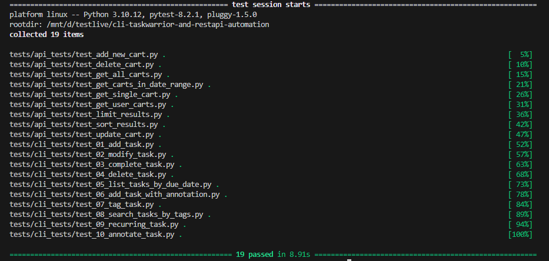

# CLI TaskWarrior Application & RestAPI Automation with Python & Pytest

This project contains an automated testing solution for CLI application (Taskwarrior) and RestAPI from Fake Store API. 

## Prerequisites:
1. Taskwarrior
2. Python
3. pip

### Setup and Installation:
- Download your required distribution from the list https://taskwarrior.org/download/
- Clone repository: https://github.com/ak-arsalan/cli-taskwarrior-and-restapi-automation.git
- VS Code IDE
- Activate virtual environment
- To install pytest and request run following:
```bash
pip install pytest
pip install requests
```

### Tests Execution:
#### To run a test, you can simply write the following command on Terminal:
```bash
pytest
```

### Test Scenarios
#### Part 1 covers the following scenarios:

# Test Scenarios

### Part 1 covers taskwarrior's following scenarios:

1. **Adding a New Task**: Tests adding a new task with a description and due date.
2. **Modifying an Existing Task**: Verifies the ability to modify an existing task's description and due date.
3. **Completing a Task**: Tests marking a task as completed and verifying it in the completed tasks list.
4. **Deleting a Task**: Verifies the deletion of a task and ensures it's not in the task list afterward.
5. **Listing Tasks by Due Date**: Tests listing tasks by due date and checks if they're displayed correctly.
6. **Adding a Task with Annotation**: Adds a task with an annotation and verifies if it's displayed correctly.
7. **Tagging a Task**: Tests adding tags to a task and verifies their application.
8. **Searching for Tasks by Tags**: Adds tasks with tags and checks if tasks with specific tags are listed correctly.
9. **Recurring Tasks**: Adds a recurring task with a weekly recurrence and ensures it's listed correctly.
10. **Annotating a Task**: Adds an annotation to a task and verifies if it's displayed correctly.

### Part 2 covers API Tests (Fake Store API)

1. **test_get_all_carts**: Tests retrieving all carts from the Fake Store API.
2. **test_get_single_cart**: Tests retrieving a single cart by its ID from the Fake Store API.
3. **test_limit_results**: Tests limiting the number of carts returned from the Fake Store API.
4. **test_sort_results**: Tests sorting the carts in descending order by their IDs from the Fake Store API.
5. **test_get_carts_in_date_range**: Tests retrieving carts within a specified date range from the Fake Store API.
6. **test_get_user_carts**: Tests retrieving carts belonging to a specific user from the Fake Store API.
7. **test_add_new_cart**: Tests adding a new cart to the Fake Store API.
8. **test_update_cart**: Tests updating an existing cart in the Fake Store API.
9. **test_delete_cart**: Tests deleting a cart from the Fake Store API.

### Test Results:


## Future Improvements:

- Enhance test coverage by automating more scenarios. Exploring more Taskwarrior commands, such as `append`, `denotate`, `duplicate`, `execute`, `export`, `import`, `log`, `prepend`, `purge`, `synchronize`, `undo`, and `version`.
- Implementing parameterized tests for API endpoints to test different input combinations.
- Integrating test reporting with pytest-html for better visualization of test results.
- Implementing error handling and logging functionality in the automation script to provide detailed feedback and troubleshooting information to users when errors occur during script execution.